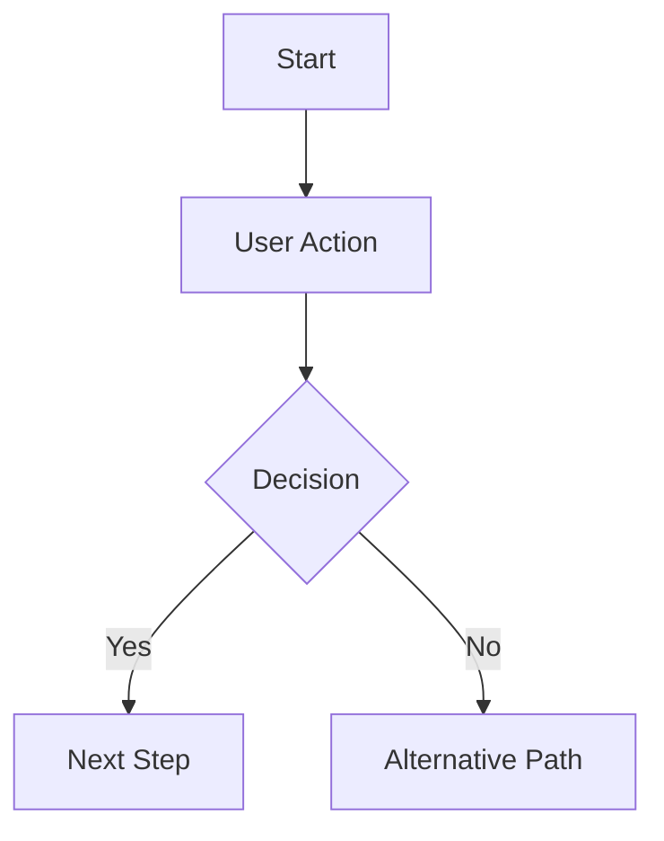
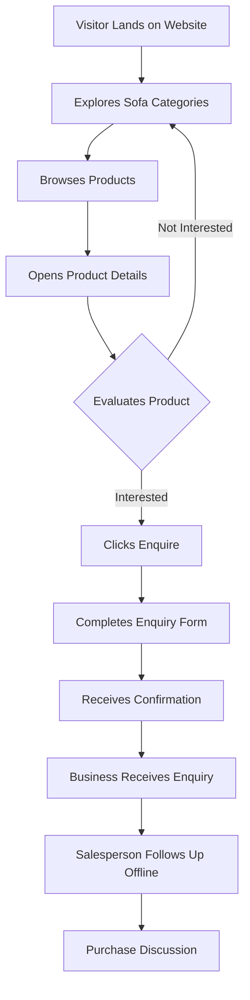
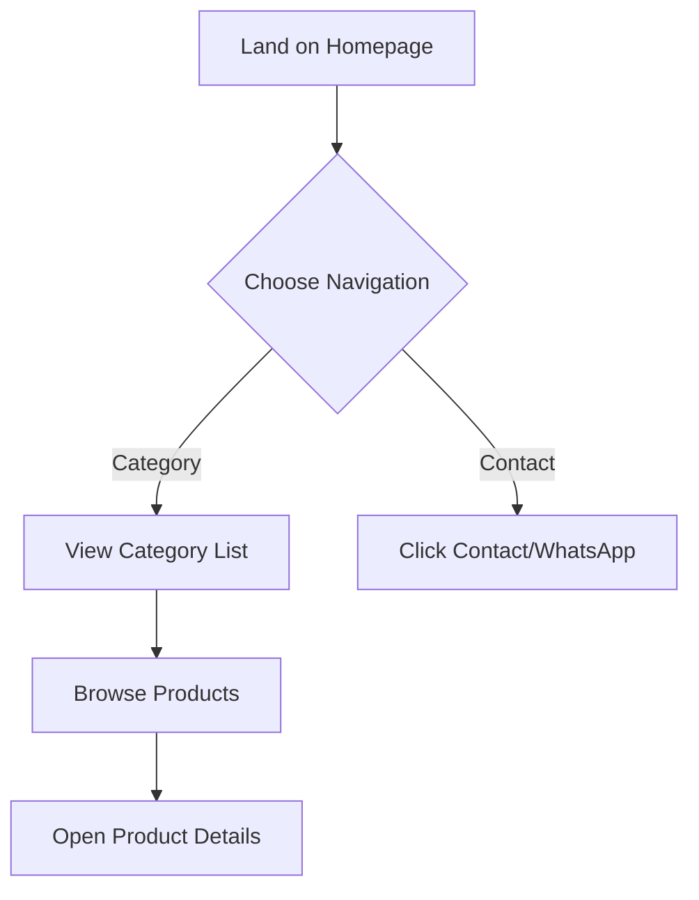
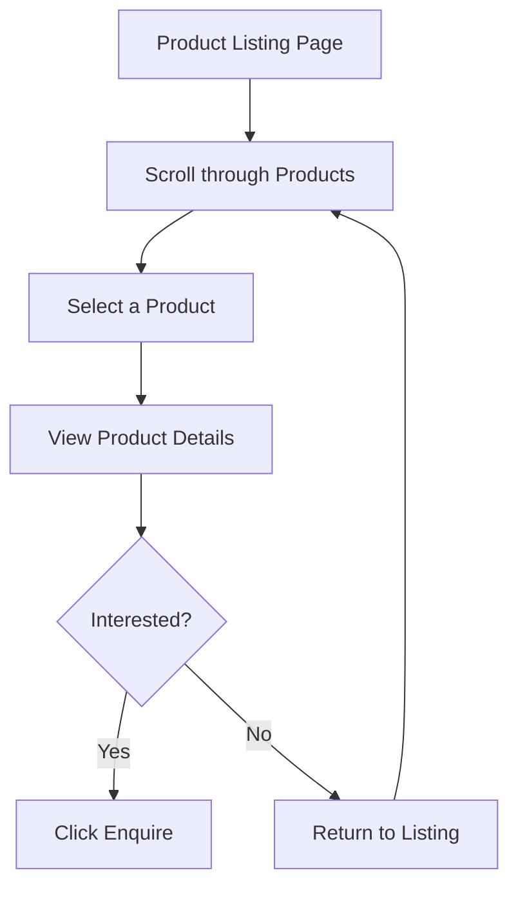
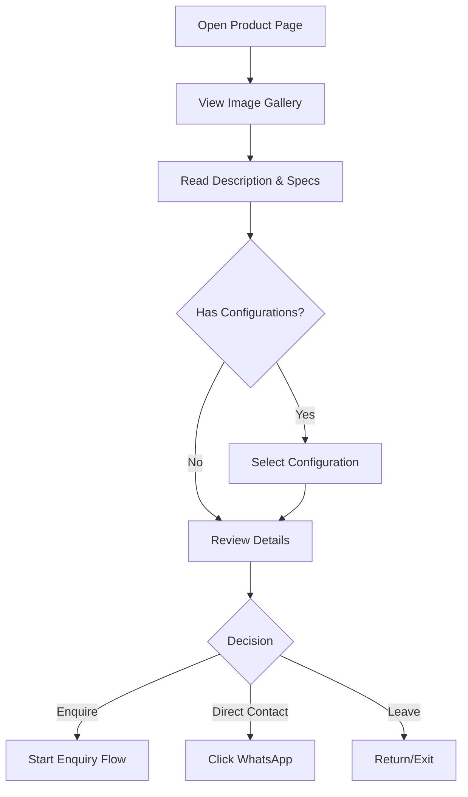
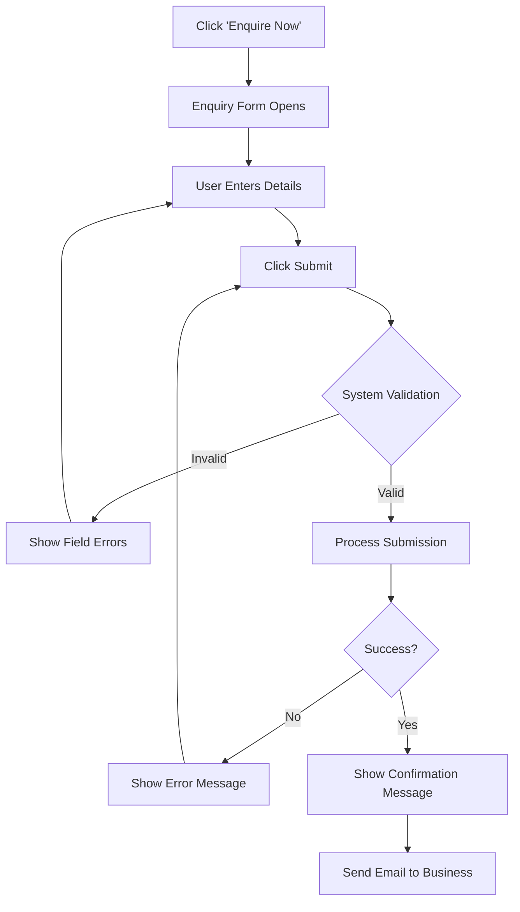
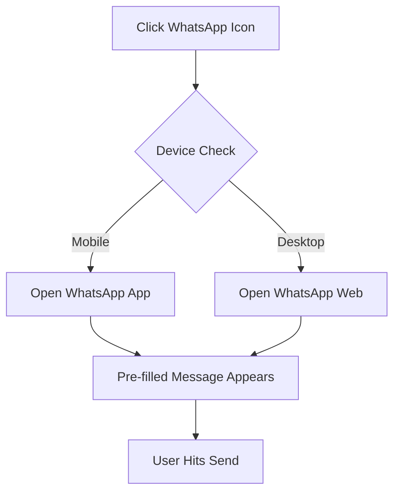
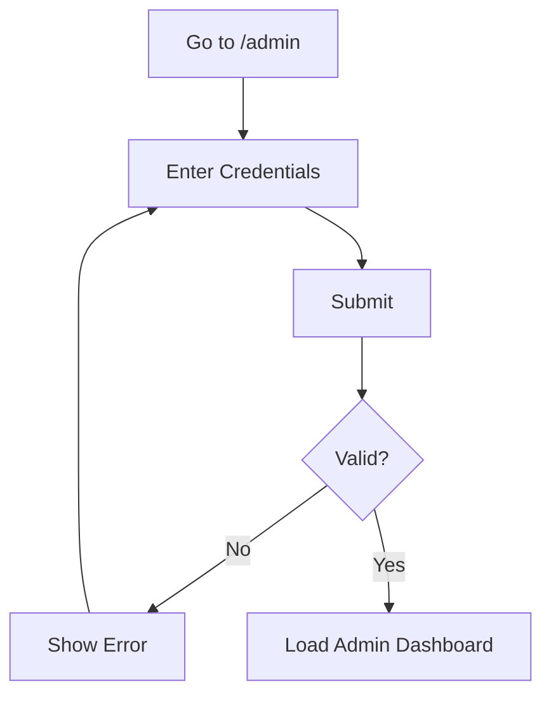
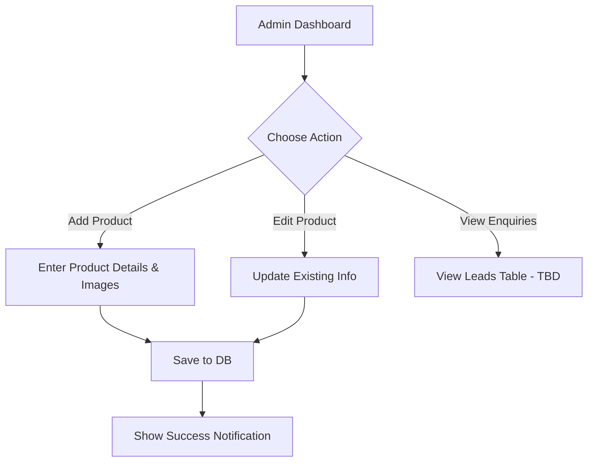

# User Flows

## 1. Document Information

| Field | Description |
|-------|-------------|
| **Product** | Kouch (MyKouch) Website |
| **Document** | User Flows |
| **Version** | 0.1 |
| **Status** | Draft |
| **Created Date** | 2026-10-01 |
| **Last Updated** | 2026-10-01 |
| **Owner** | Suruchi Kumari (UX Architect / PM) |
| **Related Documents** | `docs/PROJECT-MASTER.md`, `docs/BRD.md`, `docs/prd.md` |

---

## 2. User Types

### Customer
- **Purpose:** To browse and discover premium furniture and initiate the purchasing process.
- **Main goals:** Find the right sofa, understand options/dimensions, and easily request a quote.
- **Main product interactions:** Navigating categories, viewing product details, submitting the enquiry form, clicking WhatsApp/Phone links.

### Salesperson
- **Purpose:** To receive qualified leads from the website and convert them into sales.
- **Main goals:** Get complete context (customer contact + desired product) quickly.
- **Main product interactions:** Receiving email notifications with enquiry details. (Direct interaction with the website is minimal unless an Admin Dashboard is confirmed).

### Admin / Business Owner
- **Purpose:** To manage the digital catalog and oversee website operations.
- **Main goals:** Keep products and images up to date.
- **Main product interactions:** Logging into the backend, creating/editing products, managing configurations.

---

## 3. Flow Notation

This document uses Mermaid diagrams to visualize flows. The standard notation is:

Text notation is also used for simplicity in some sections:
`[Start]` → `[User Action]` → `[System Response]` → `<Decision>`

---

## 4. Overall Customer Journey

The high-level journey maps the enquiry-based furniture buying model.

- **Starting point:** Website homepage or category page.
- **Major stages:** Discovery → Evaluation → Enquiry → Offline Sales.
- **Decision points:** Whether a product meets their needs; whether to enquire via form or direct contact.
- **End state:** Customer awaits salesperson contact; Business has a qualified lead.

---

## 5. Website Discovery Flow

Documenting how a new visitor discovers and explores Kouch.

### Happy Path
Visitor lands on Homepage → Views featured categories → Clicks "L-Shape Sofas" → Browses list → Opens a product → Enquires.

### Alternative Paths
- Visitor wants more information: Navigates to "About Us" (if applicable) or scrolls through homepage trust banners.
- Visitor chooses to contact directly: Clicks WhatsApp floating icon from the Homepage instead of browsing.
- Visitor doesn't find a suitable product: Clicks "Contact Us" to ask about custom orders.

---

## 6. Product Browsing Flow

- **User action:** Scroll, click product.
- **System response:** Load category page, load product details page.
- **Decision points:** Does the product look appealing from the thumbnail? Is the user interested after reading details?
- **Alternative paths:** Clicking another category from the top navigation instead of going back.
- **End states:** Moves to Enquiry Flow, or exits site.

---

## 7. Product Detail Flow

- **Decision explicit:** `Is the customer interested in getting a quote?`
  - Yes (Form) → Start enquiry.
  - Yes (Direct) → WhatsApp click.
  - No → Return to products / Exit.

---

## 8. Customer Enquiry Flow

This maps the core conversion engine of the Kouch website.

### Happy Path
Form opens (pre-filled with Product ID/Config) → User enters Name, Phone, Email → Clicks Submit → Validation passes → Success message shown → Admin receives email.

### Validation Path
User leaves "Name" blank → Clicks Submit → System highlights "Name" in red → User corrects and resubmits.

### Failure Path
Network drops during submission → System shows "Submission failed. Please check your connection." → User clicks submit again.

### Abandonment Path
User opens form → Realizes they don't want to provide a phone number → Clicks 'X' or clicks outside modal to close.

---

## 9. Contact / Communication Flow

- **Separation of concerns:** Clicking WhatsApp or Phone CTA hands the flow over to the user's operating system (app or dialer). The website's responsibility ends at generating the correct deep link (e.g., `wa.me/1234567890?text=Hi...`).

---

## 10. Search Flow
`Search flow: Not applicable to current MVP.` (Marked as TBD in PRD).

---

## 11. Filter & Sort Flow
`Filter & Sort flow: Not applicable to current MVP.` (Marked as TBD in PRD).

---

## 12. Authentication Flow

`Customer Authentication Flow: Not applicable to current product scope.` (Public catalog only).

**Admin Authentication Flow:**

---

## 13. Admin / Business Flow

*(Note: "View Enquiries" in the backend is TBD per PRD; currently assumed as Email-based).*

---

## 14. Error & Exception Flows

### Invalid form
Form → Submit → Validation error (inline red text) → User corrects data → Submit again.

### Network/API failure
Enquiry submit → Request fails (Timeout/500) → Show toast/alert: "Something went wrong. Please try again." → User retries.

### No products in Category
Product listing → Backend returns 0 products → Show empty state: "No products available in this category yet." → Show CTA: "Browse All Sofas".

### Product unavailable / 404
Customer clicks old link → Product not found → 404 Page → "This sofa is no longer available" → CTA: "Back to Home".

---

## 15. Mobile User Flows

- **Navigation:** On desktop, categories are visible in the top header. On mobile, the user must click a Hamburger Menu to reveal categories. This adds one interaction step to the Discovery Flow.
- **CTAs:** The "Enquire" button on mobile should be "sticky" at the bottom of the screen while scrolling the product page, reducing the need to scroll back up to take action.
- **WhatsApp:** On mobile, clicking WhatsApp opens the native app seamlessly. On desktop, it requires WhatsApp Web QR authentication if not logged in.

---

## 16. Returning Customer Flow

- **Path:** Returning visitor → Opens website → Remembers a specific sofa → Navigates directly to category → Finds product → Enquires.
- There is no authenticated path (no customer login), so returning users experience the site identically to new users, aside from browser caching making it faster.

---

## 17. Complete End-to-End Flows

### Flow A — Discover Product
Visitor → Homepage → Clicks Hamburger Menu (Mobile) → Selects "Recliners" → Scrolls list → Taps Recliner image → Views details, reads specs.

### Flow B — Product Enquiry
Visitor → On Product Page → Selects "Brown" configuration → Clicks "Enquire Now" → Form modal pops up → Enters John Doe, 555-0199 → Clicks Submit → Sees "Thank You" screen → Closes modal.

### Flow C — Contact Business
Visitor → On any page → Taps floating WhatsApp bubble → OS opens WhatsApp app → Message reads "Hi Kouch, I have an enquiry" → Visitor hits send in WhatsApp.

### Flow D — Business Handles Enquiry
*(Assuming Email flow as per MVP PRD)*
Business → Receives Email alert → Reads "John Doe is interested in Product X (Config: Brown)" → Salesperson calls 555-0199 → Discusses requirements → Quotes price offline.

---

## 18. Flow Details

**Flow B: Product Enquiry**

| Step | Actor    | Action         | System Response       | Decision | Next Step |
| ---- | -------- | -------------- | --------------------- | -------- | --------- |
| 1    | Customer | Views Product  | Loads product details | Enquire? | 2 (Yes) / Exit (No) |
| 2    | Customer | Selects Config | Highlights selection  | —        | 3         |
| 3    | Customer | Clicks Enquire | Opens Modal Form      | —        | 4         |
| 4    | Customer | Enters Data    | Validates input types | Submit?  | 5         |
| 5    | Customer | Clicks Submit  | Validates required    | Valid?   | 6 (Yes) / 4 (No) |
| 6    | System   | Sends Payload  | API Call to Backend   | Success? | 7 (Yes) / 4 (Error) |
| 7    | System   | API Success    | Shows "Thank You"     | —        | 8         |
| 8    | Customer | Clicks Close   | Closes Modal          | —        | End       |

---

## 19. Flow States

**Enquiry Flow States:**
- **Start State:** User is viewing a product page.
- **Active State:** User is typing into the modal form fields.
- **Decision State:** System checks if Name/Phone are filled out upon submit.
- **Success State:** Form disappears, replaced by a green checkmark and thank you message.
- **Failure State:** Red border around missing fields; or toast message for network error.
- **Exit State:** User clicks 'X' or background overlay to dismiss the modal, returning to the Start State.

---

## 20. MVP Flow Scope

### MVP
- Category Navigation & Product Discovery Flow.
- Product Details Flow.
- Customer Enquiry Form Flow.
- WhatsApp / Phone deep-linking.
- Admin Login & Basic CRUD Flow.

### TBD / Post-MVP
- Search & Filter Flows.
- Admin Enquiry Dashboard Flow (currently email-based).
- "Become a Dealer" specific flow (currently assumed generic contact).

---

## 21. Traceability

| PRD Requirement | User Flow | Flow Step | Status |
| --------------- | --------- | --------- | ------ |
| PRD-FR-001 (Catalog list) | 6. Product Browsing | Category click | Covered |
| PRD-FR-003, 004 (Images/Config) | 7. Product Detail | Load details | Covered |
| PRD-FR-006 (Form context) | 8. Customer Enquiry | Modal opens | Covered |
| PRD-FR-007 (Required info) | 8. Customer Enquiry | Validation | Covered |
| WhatsApp/Phone Links | 9. Contact Flow | Click CTA | Covered |
| Admin Product CRUD | 13. Admin Flow | Add Product | Covered |

---

## 22. Open Questions

| Question | Related Flow | Why It Matters | Status |
| -------- | ------------ | -------------- | ------ |
| Will the enquiry form include a CAPTCHA? | 8. Enquiry Flow | Adds friction to the user experience but prevents spam. | Open |
| Do we want to auto-close the success modal after X seconds, or require a click? | 8. Enquiry Flow | Minor UX detail impacting post-enquiry engagement. | Open |
| Are "Offers" going to link directly to products, or just act as static banners? | 5. Discovery Flow | Changes how users navigate from the Offers page. | Open |
